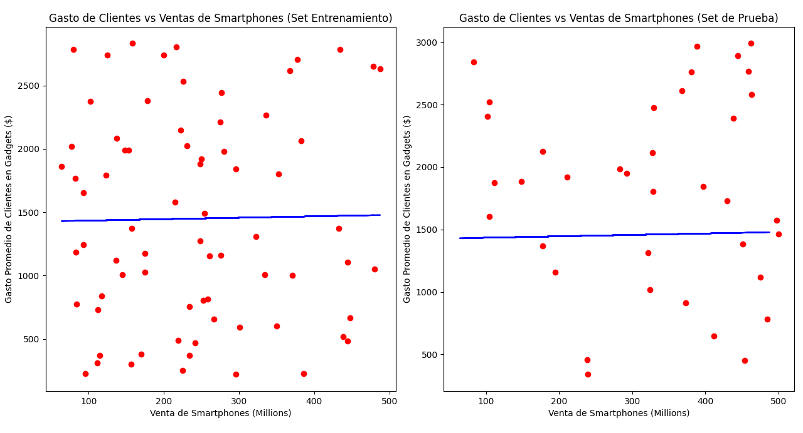

# Regresión Lineal Simple: Relación entre Ventas de Smartphones y Gasto en Gadgets

Este proyecto investiga la relación entre las **Ventas de Smartphones** (en millones) y el **Gasto Promedio del Consumidor en Gadgets** ($). Los datos utilizados provienen de un dataset obtenido en [Kaggle](https://www.kaggle.com/), y se ha aplicado una **Regresión Lineal Simple** para modelar la relación entre estas dos variables.

## Variables del Estudio

- **Variable Independiente (X):** Ventas de Smartphones (Millones)
- **Variable Dependiente (Y):** Gasto Promedio del Consumidor en Gadgets ($)

La hipótesis principal de este análisis es que el aumento en las ventas de smartphones podría llevar a un mayor gasto en gadgets tecnológicos debido a compras complementarias o un mayor compromiso con la tecnología.

---

## Entrenamiento y Desempeño del Modelo

Para entrenar el modelo de regresión lineal, dividimos el conjunto de datos en un conjunto de entrenamiento (2/3 de los datos) y un conjunto de prueba (1/3). El modelo entrenado produjo la siguiente ecuación de la línea de regresión:

$$
\hat{y} = 0.113 \cdot X + 1422.88
$$

### Interpretación de los Coeficientes

- **Pendiente (0.113):** Por cada millón adicional de smartphones vendidos, el modelo predice un aumento de aproximadamente $113 en el gasto promedio del consumidor en gadgets.
- **Intersección (1422.88):** Cuando las ventas de smartphones son cero, el modelo predice un gasto promedio de $1422.88. Aunque este valor no es muy realista, es el resultado obtenido con las limitaciones de la regresión lineal simple aplicada.

---

## Precisión del Modelo

El coeficiente de determinación R² en el conjunto de prueba es:

$$
R^2 = -0.217
$$

Este valor negativo sugiere que el modelo tiene un desempeño peor que una línea horizontal que represente el valor promedio. En otras palabras, el modelo no logra capturar ningún patrón predictivo real en los datos de prueba.

### Interpretación de los Gráficos

1. **Gráfico de Entrenamiento:** La mayoría de los puntos reales (rojos) están dispersos ampliamente alrededor de la línea azul (valores predichos). Esto indica que el modelo lineal no se ajusta bien a los datos de entrenamiento.
2. **Gráfico de Prueba:** Los puntos de prueba (rojos) se desvían significativamente de la línea de regresión, confirmando el valor negativo de R² y mostrando que el modelo no generaliza bien a datos no vistos previamente.

---

## Conclusiones

A pesar de que la hipótesis de que las ventas de smartphones podrían influir en el gasto en gadgets parece plausible, la relación lineal entre estas dos variables no es clara en este conjunto de datos. El valor negativo de R² y la dispersión observada en los gráficos sugieren lo siguiente:

1. **Posibles relaciones no lineales:** El modelo lineal no captura bien la relación, por lo que podría ser útil aplicar otro tipo de regresiones que consideren formas no lineales.
2. **Influencia de variables adicionales:** El gasto en gadgets podría depender de otros factores, como el envío de laptops, la adopción de consolas de videojuegos, entre otros. Esto afecta la precisión del modelo.
3. **Presencia de valores atípicos:** Aunque hay algunos valores atípicos, no son la principal causa de la dispersión observada. Los valores atípicos son pocos y no afectan significativamente al modelo.

Este análisis demuestra que, aunque la relación entre las variables puede existir, el modelo de regresión lineal simple no es el mejor enfoque para capturar esta relación.
